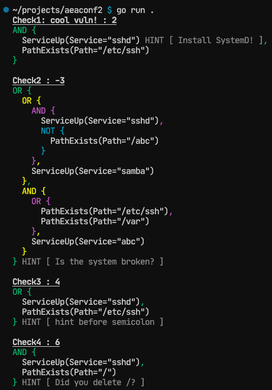

# aeaconf2

new config format for [aeacus](https://github.com/elysium-suite/aeacus)

## syntax

- the beginning part is ini
- the check/condition definitions use the custom language
- comments are denoted by two forward slashes ("//")

```hcl
[round]
title = Linux ICC
os = Ubuntu 20.04.03
user = cpadmin
local = false
maxPoints = 32 ; optional (see "Check6" below)

[remote]
enable = true
name = LinICC
server = https://scoring.cyberaegis.tech
password = password
---
// check messages must be enclosed in quotes
"Check1: cool vuln!": 2
  // condition lines MUST be indented

  // functions may have individual hints, enclosed in square brackets
  ServiceUp "sshd" ["Install SystemD!"]

  // lines that don't end in a boolean operator are implicitly ANDed
  PathExists "/etc/ssh"

// entire checks may have hints
"Check2": -3 ["Is the system broken?"]
  // lines that end in boolean operators continue the expression on the next line
  ServiceUp "sshd" && PathExistsNot "/abc" || ServiceUp "samba" ||

  // parentheses may be used as you would in any other boolean expression
  (PathExists "/etc/ssh" || PathExists "/var") && ServiceUp "abc"

// checks can be shortened to a single line with a semicolon (;)
"Check3": 4 ["hint before semicolon"]; ServiceUp "sshd" || PathExists "/etc/ssh"
// note that single-line checks cannot have conditions on following indented lines;
// the entire boolean expression must be on one line.

"Check4": 6
  // hints can also be specified on parenthesized expressions
  (ServiceUp "sshd" && PathExists "/") ["Did you delete /?"]

// check names can be autogenerated based on conditions
_: 7
  ServiceUp "apache2"

  // the generated check name will be "Service 'apache2' is running"
  // (see DefaultString() implementation)

// points can also be autogenerated based on context:
// points will be evenly distributed amongst vulns
// for which their point value is not specified
// at the higest point value such that the total image point value
// doesn't exceed `maxPoints` (default 100)
"Check6": _
  PathExists "/etc/nginx"

// you can even do both!
_: _; ServiceUp "nginx"
```

# parsed

- checks are serialized directly to their respective function struct, e.g. `PathExists`
- each function must implement `Score() bool`. other than that, new functions you add in `functions.go` **just work**

this is the parsed output (it parses hints on a per-check, per-condition, and even per-boolean-expression level)


